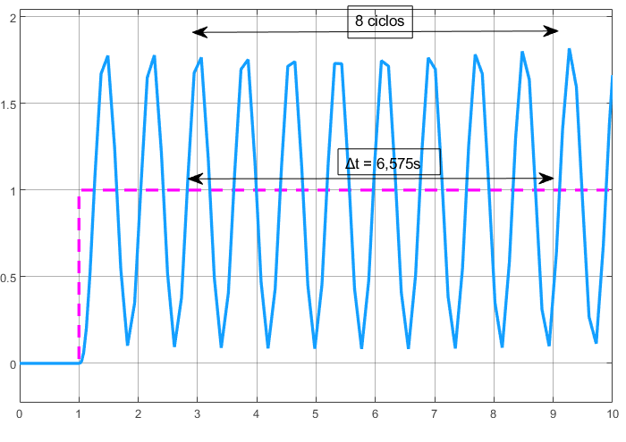
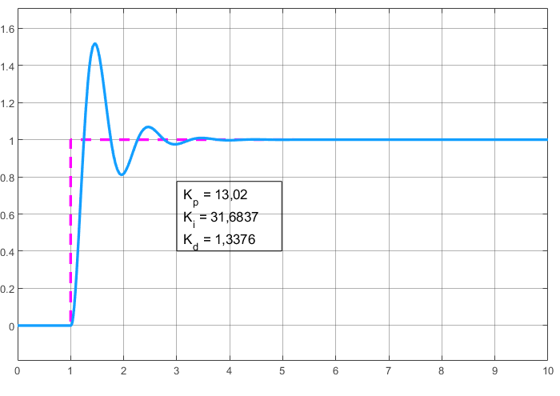
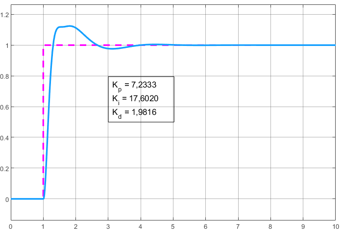

# Método $K_u$
 
## Materiais

- [Planta 1](./models/planta_1_Ku.slx)
- [Planta 2](./models/planta_2_Ku.slx)

## Roteiro

Considerando um sistema regido pelo seguinte polinômio:

$G = \frac{48}{(s+12) (s+4)(s+1)}$

.png)

Devemos incrementar o ganho proporcional até o sistema entrar em oscilação sustentada.

(1).png)

Para isso, vamos estimar o ganho máximo ($K_u$):

```matlab
>> K_u = 21.7; %? Por que 21.7?
```

Com o sistema fechado, obtemos a seguinte resposta:

```matlab
>> G_cloop = feedback(K_u * G, 1);
```



Fazendo o cálculo para obter o período do ganho máximo:

```matlab
>> delta_t = 6.575;
>> cicle_count = 8;

>> t_u = delta_t / cicle_count;
>> f_u = 1 / t_u;
```

Com isso obtivemos $T_u = 0.8219$

Assim, podemos utilizar a [Tabela de Zieger-Nichols] para obter os ganhos do PID:

```matlab
% PID Classico
>> K_p = 0.6 * K_u;
>> K_i = 1.2 * (K_u / t_u);
>> K_d = 0.075 * K_u * t_u;
```

Passando os valores de ganho proporcional, integral e derivativo para um controlador PID no Simulink, pudemos obter o seguinte resultado:



Podemos observar que há um overshoot bastante elevado (próximo de 60%). Por isso, vamos ajustar o controlador novamente utilizando a [Tabela de Ziegler-Nichols]:

```matlab
% Com overshoot
>> K_p = (1/3) * K_u;
>> K_i = (2/3) * (K_u / t_u);
>> K_d = (1/9) * K_u * t_u;
```

Obtendo, por fim, a seguinte resposta:



## Conclusões

- O método $K_u$ consiste em calcular os ganhos de um controlador PID através de seu ganho máximo.
- O ganho máximo é obtido quando o o sinal de saída entra em oscilação constante.
- O ganho máximo pode ser obtido observando o local geométrico das raízes do controlador
- Após encontrado, utilizamos este ganho para calcular os ganhos do controlador de acordo com a [Tabela de Ziegler-Nichols].
- Com base no resultado obtido, ajustamos os ganhos novamente de acordo com a tabela.

[Tabela de Ziegler-Nichols]: ../ziegler_nichols.md