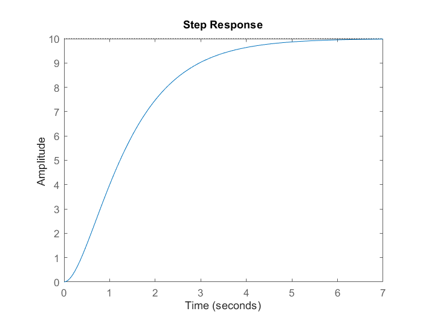
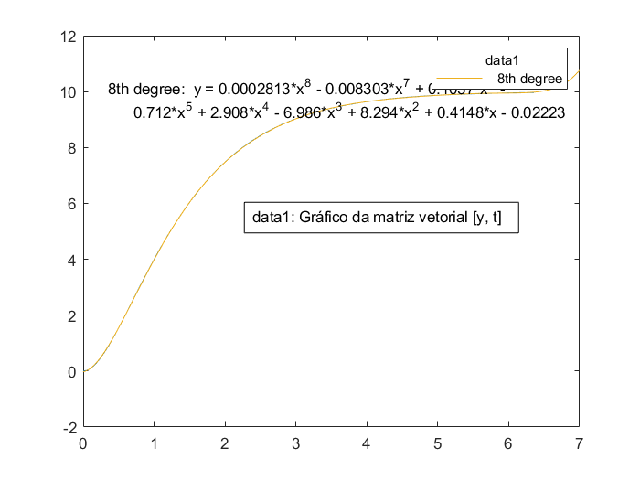
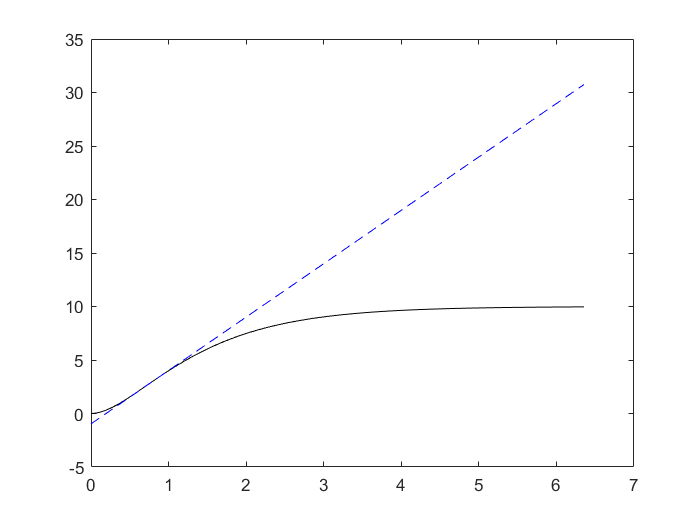
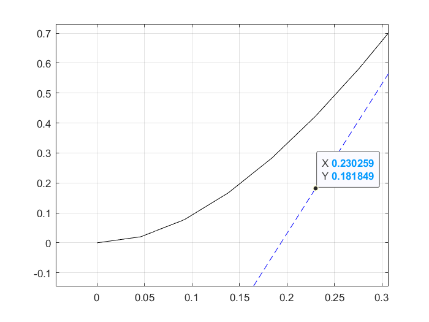

# Resposta em malha aberta para entrada em degrau

Sendo a função de transferência do sistema dada por:

$G = \frac{20}{(s+2)(s+1)}$

Temos a seguinte curva:



Estamos tentando encontrar o ponto de inflexão desta curva. O ponto de inflexão é o ponto em que a curva inicia sua transição e estado permanente para o degrau unitário. Para encontrar este ponto vamos utilizar a ferramenta de basic fitting.

Para isso, precisamos transformar o gráfico da função de transferência $G$ em um ma matriz de vetores: 

```matlab
>> t = 0:0.01:14;
>> [y, t] = step(G);
>> figure; plot(t, y)
```

Dessa forma, podemos utilizar a opção `Tools > Basic Fitting` presente na figura. Essa ferramenta nos permite obter um polinômio gerador para a curva que estamos utilizando. Recomendo utilizar polinômios do 8a ordem ou superior para obter um resultado mais preciso.



Após isso, podemos exportar os dados desse polinômio para uma variável `fit`

```matlab
>> fit 

    type: 'polynomial degree 8'
    coeff: [2.8126e-04 -0.0083 0.1037 -0.7120 2.9078 -6.9863 8.2936 0.4148 -0.0222]
```

Iremos agora derivar o polinômio obtido duas vezes para encontrar o ponto de inflexão. Para isso, utilizamos a função `polyder` do MATLAB.

```matlab
>> p = fit.coeff; % variável com os coeficientes do polinômio de 8a ordem
>> d_p = polyder(p);
>> dd_p = polyder(d_p);
```

Calculamos as raízes de dd_p para descobrir os pontos de inflexão

```matlab
>> roots(dd_p)

    ans =
        5.9353 + 0.0000i %!
        4.9063 + 0.4897i
        4.9063 - 0.4897i
        2.8393 + 1.4654i
        2.8393 - 1.4654i
        0.7149 + 0.0000i %!
```

Estamos procurando raízes reais, pois estamos falando do domínio tempo. Dentre as duas raízes, a que mais se encaixa com o ponto de inflexão é a 6a, portanto utilizaremos ela para prosseguir:

```matlab
>> x = ans(6);
```

Levantando os dados que faltam para determinar a reta tangente à curva de resposta da planta e que passe pelo ponto de inflexão, lembramos da equaçao da reta:

$y = a \cdot t + b$

```matlab
>> a = polyval(d_p, x);
>> b = polyval(p, x) - a*x;
```

O polinômio da reta tangente ao ponto de inflexão de $G$ é:

```matlab
>> G_ = [a b];
```

Agora, podemos plotar a reta tangente ao ponto de inflexão da curva de resposta da planta:

```matlab
>> y_G_ = a .* t + b; % esta é a reta tangente
>> figure; plot(t, y, 'k-', t, y_G_, 'b--')
>> axis([-0.5 0.5 -0.5 2])
```



$L$ corresponde ao ponto no qual a reta cruza o eixo quando $y = 0$, e $T$ pode ser determinado descobrindo $t1$, onde $t1 = L + T$. Para encontrar estes pontos, basta fazer:

```matlab
>> L = -b/a; 
>> t1 = (10 - b)/a;
>> T = t1 - L;
```




Assim obtendo o polinômio que representa o Controlador PI:

```matlab
s = tf('s');
>> C_PI_1 = 0.6 * T * (s + 1/l)^2/s
```

$C_{PI} = \frac{1,2025 (s+5,16)^2}{s}$

Agora podemos plotar a resposta em malha fechada do sistema com o controlador PI[^1]:

```matlab
>> oloop_tf_PI_1 = C_PI_1 * G;
>> cloop_tf_PI_1 = feedback(oloop_tf_PI_1, 1);

>> figure; step(cloop_tf_PI_1)
>> stepinfo(cloop_tf_PI_1)
    ans = 

            RiseTime: 0.0575
        TransientTime: 0.3761
        SettlingTime: 0.3761
        SettlingMin: 0.9179
        SettlingMax: 1.1569
            Overshoot: 15.6922
        Undershoot: 0
                Peak: 1.1569
            PeakTime: 0.1565
```


[^1]: `oloop` é a abreviação de Open Loop e `cloop` é a abreviação de Closed Loop.

## Resumindo

O método de sintonia do PID por resposta em malha aberta para entrada em degrau implica em encontrar uma equação que descreva a curva de resposta da planta ao degrau unitário, derivar essa equação duas vezes para encontrar o ponto de inflexão, e então determinar a reta tangente a esse ponto. A interseção dessa reta com o eixo $t$ nos dá o tempo morto $L$, e a diferença entre o tempo de subida e o tempo morto nos dá o tempo de acomodação $T$. Com esses valores, podemos determinar o controlador PI q  ue sintoniza o sistema para a resposta desejada.
