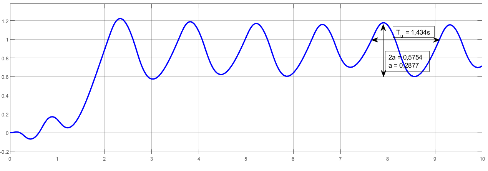
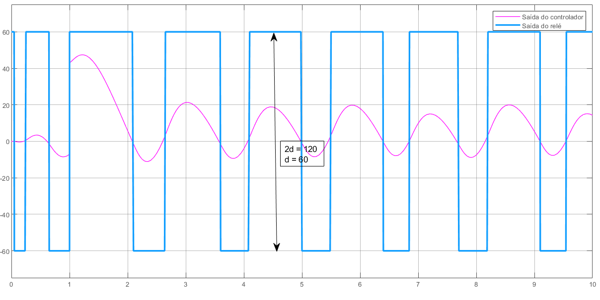
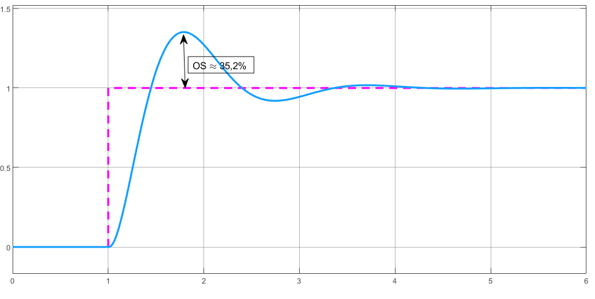

# Método do relé

## Materiais

- [Diagrama de ajuste]
- [Diagrama do PID]

## Roteiro

Considerando a seguinte função de transferência:

$G = \frac{1}{(s+10) (s+2) (s+1)}$

Obtemos o ganho de baixa frequência do controlador :

```matlab
>> dcgain(G)
    
    ans =

        0.0500
```

Inserimos este valor de ganho como $t$ no [Diagrama de ajuste] no Simulink.

Obtemos os valores de amplitude e período de acordo com a saída do controlador.



```matlab
>> a = 0.2877;
>> T_u = 1.434;
```

Após isso, obtemos a amplitude da saída do relé:



```matlab
>> d = 60;
```

Após, calculamos os valores de ganho utilizando a [Tabela de Ziegler-Nichols](../ziegler_nichols.md).

```matlab
>> K_u = (4 * d) / (pi * a);    % Ganho máximo do controlador
>> K_p = 0.6 * K_u;             % Ganho proporcional
>> K_i = 1.2 * (K_u / T_u);     % Ganho integrativo
>> K_d = 0.074 * (K_u * T_u);   % Ganho derivativo
```

Com base nesses valores, remontamos o sistema utilizando estes ganhos para realizar o controle PID como é mostrado no [Diagrama do PID], resultando na seguinte saída:



O sistema pode ser melhorado ajustando os ganhos (reduzindo $K_p$ e $K_i$, e mantendo $K_d$)

[Diagrama de ajuste]: ./models/planta_ajuste_metodo_rele.slx
[Diagrama do PID]: ./models/planta_2_PID.slx

## Conclusões

É possível constatar que o método do relé é um dos métodos mais simples de sintonização do PID, pois exige menos etapas na sua execução.