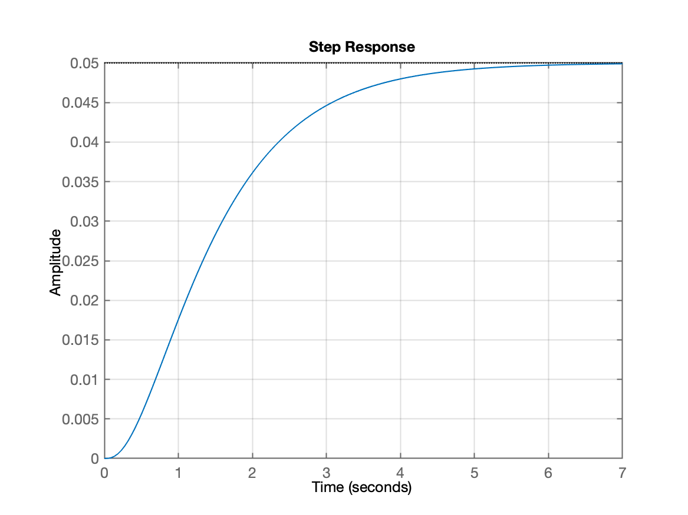
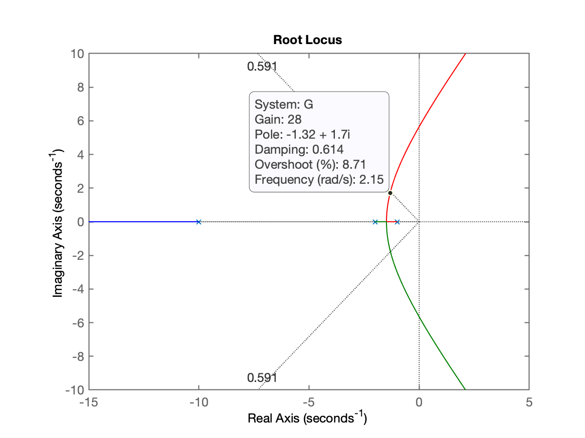
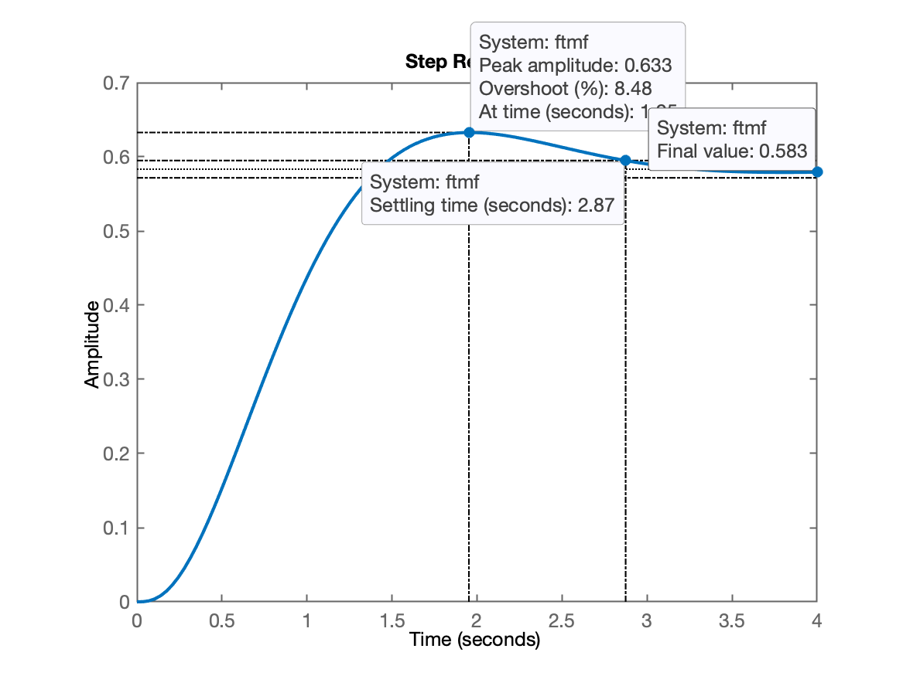

% # Projeto de Controladores

% Planta adotada:

$$
G(s) = \dfrac{1}{(s+1)(s+2)(s+3)}
$$

% Ingressando dados no Matlab:

% ```Matlab
G = tf( 1, poly( [-1 -2 -10] ) )

G =
 
             1
  ------------------------
  s^3 + 13 s^2 + 32 s + 20
 
Continuous-time transfer function.

zpk( G  )

ans =
 
          1
  ------------------
  (s+10) (s+2) (s+1)
 
Continuous-time zero/pole/gain model.

% ```

Fim
{Unrecognized function or variable 'Fim'.
} 
save planta
diary off

% Observando resposta ao degrau em malha-aberta:

%```Matlab
step(G)
%```

% 

diary off

% ## Projeto de Controlador Proporcional

% Requisitos de controle:

% * Overshoot m�ximo de 10%;
% * Erro m�ximo de 10%

%```Matlab
OS=10; % overshoot
zeta=(-log(OS/100))/(sqrt(pi^2+(log(OS/100)^2)))

zeta =

    0.5912

close all
rlocus(G)
zpk(G)

ans =
 
          1
  ------------------
  (s+10) (s+2) (s+1)
 
Continuous-time zero/pole/gain model.

hold on
sgrid(zeta)
rlocus(G)
hold on
sgrid(zeta,0)
axis([-15 5 -10 10])
%``` 

% Segue gr�fico do RL mostrando ganho adotado:

% 

% Ser� adotado $K=28$...

% Fechando a malha:

%```Matlab
K=28;
ftmf=feedback(K*G,1);
figure; step(ftmf)
%```

Resposta � entrada degrau unit�ria:



Coment�rios:

jfdsfjdsaf


Encerrando o Matlab

```Matlab
save planta
diary off
```

Fim.
